# Vaelyria - Active Directory Management Application

Une application Flask complète pour la gestion des comptes Active Directory avec des fonctionnalités avancées incluant la gestion des utilisateurs, le contrôle des groupes, la gestion des profils et les capacités d'export Excel.

## Vue d'ensemble des fonctionnalités

### Tableau de bord

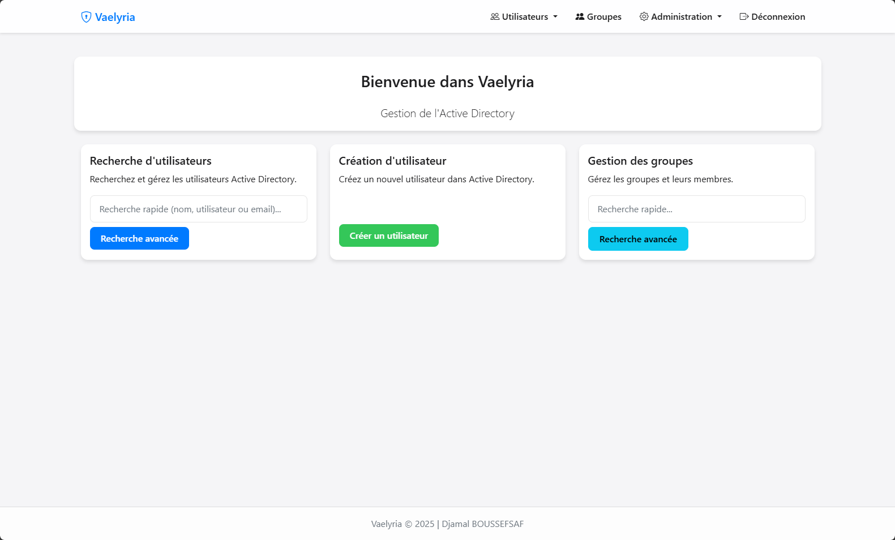

- Vue d'ensemble en temps réel du statut Active Directory
- Accès rapide à toutes les fonctionnalités principales via une interface intuitive
- Barre de recherche rapide pour les utilisateurs
- Raccourcis pour la création d'utilisateurs et la gestion des groupes

### Statistiques

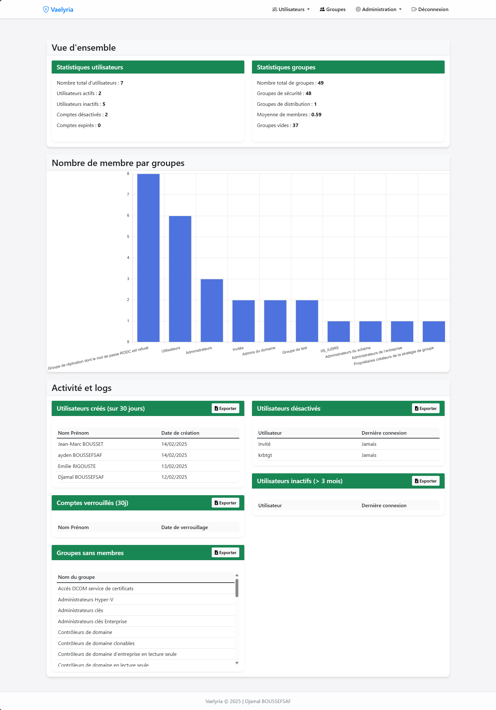

- Statistiques détaillées des utilisateurs :
  - Nombre total d'utilisateurs
  - Utilisateurs actifs et inactifs
  - Comptes désactivés et expirés
- Statistiques des groupes :
  - Nombre total de groupes
  - Répartition groupes de sécurité / distribution
  - Moyenne de membres par groupe
  - Groupes vides
- Graphiques interactifs :
  - Distribution des utilisateurs par OU
  - Top des groupes par nombre de membres
- Métriques d'activité :
  - Connexions récentes
  - Changements de mot de passe
  - Comptes verrouillés
  - Utilisateurs récemment créés
- Export Excel pour chaque catégorie de statistiques

### Gestion des utilisateurs

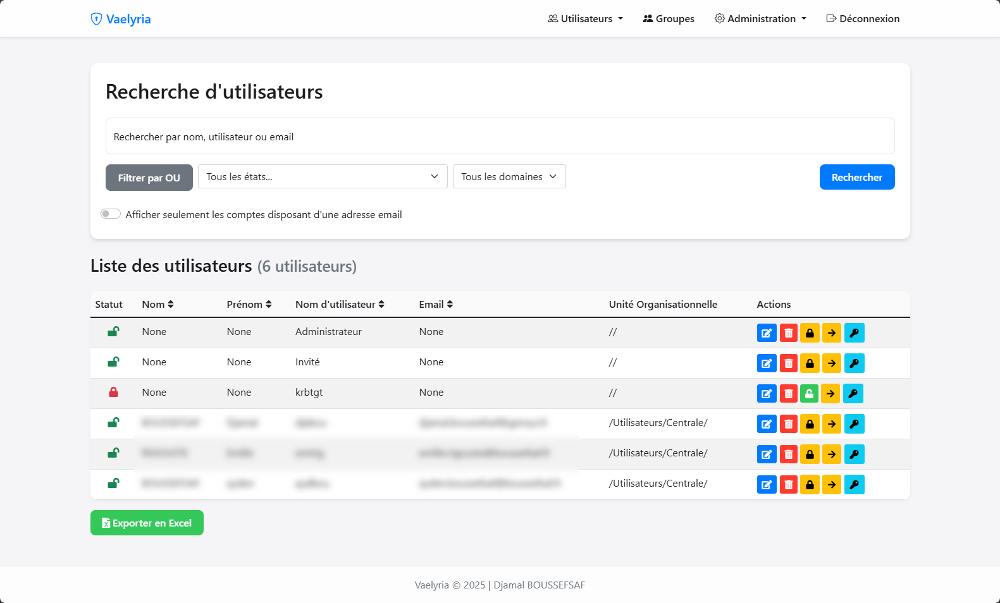

- Liste complète des utilisateurs avec capacités de recherche avancée
- Filtres multiples :
  - État du compte (actif, désactivé, verrouillé, etc.)
  - Unité organisationnelle
  - Domaine
  - Présence d'email
- Tri dynamique par colonnes
- Actions en masse sur les utilisateurs
- Export des résultats de recherche en Excel

#### Création d'utilisateur

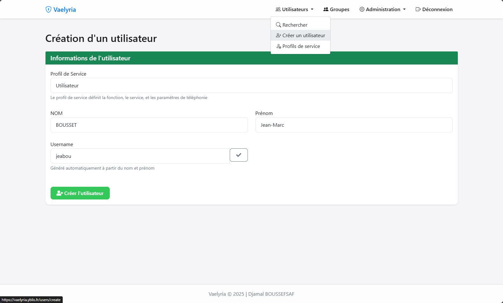

- Processus simplifié de création d'utilisateur
- Sélection de profil de service pour pré-remplir les attributs
- Génération automatique du nom d'utilisateur selon les règles configurées
- Validation en temps réel de la disponibilité du nom d'utilisateur
- Support des attributs étendus :
  - Informations personnelles
  - Coordonnées professionnelles
  - Appartenance aux groupes
  - Configuration de la messagerie

#### Édition d'utilisateur

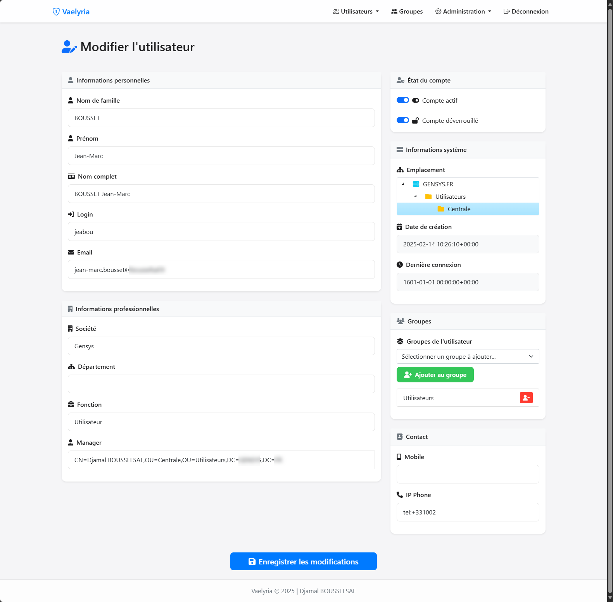

- Interface complète d'édition de profil utilisateur
- Gestion des informations personnelles et professionnelles
- Contrôle du statut du compte :
  - Activation/désactivation
  - Verrouillage/déverrouillage
- Gestion des groupes avec interface drag-and-drop
- Sélection du manager via recherche dynamique
- Historique des actions et dernière connexion
- Réinitialisation du mot de passe avec options avancées

### Gestion des groupes

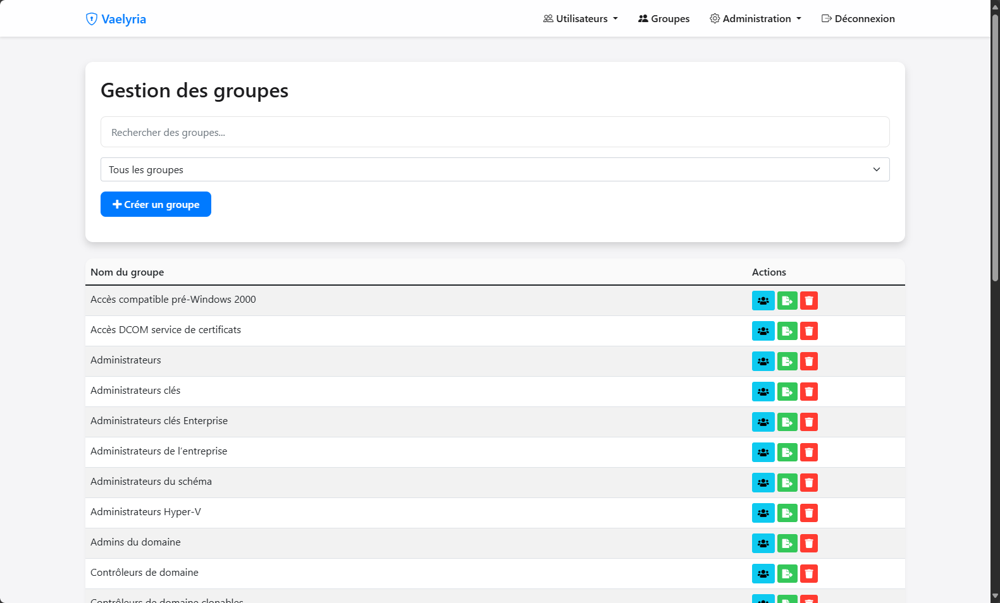

- Interface intuitive de gestion des groupes
- Recherche et filtrage des groupes
- Création de nouveaux groupes avec paramètres avancés
- Vue d'ensemble des membres
- Export des membres en Excel avec sélection des attributs

#### Création de groupe

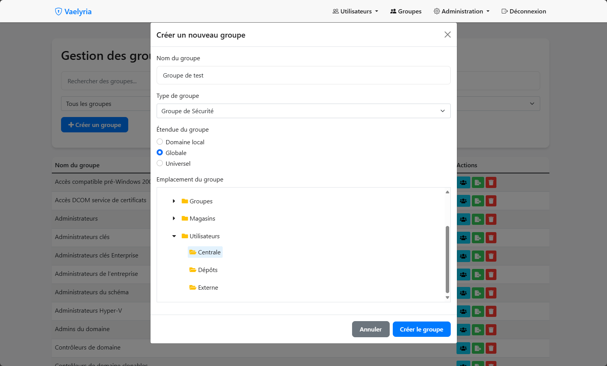

- Interface de création de groupe intuitive
- Sélection du type de groupe :
  - Groupe de sécurité
  - Groupe de distribution
- Configuration de l'étendue :
  - Domaine local
  - Global
  - Universel
- Sélection de l'emplacement (OU) via arborescence LDAP

#### Administration des groupes

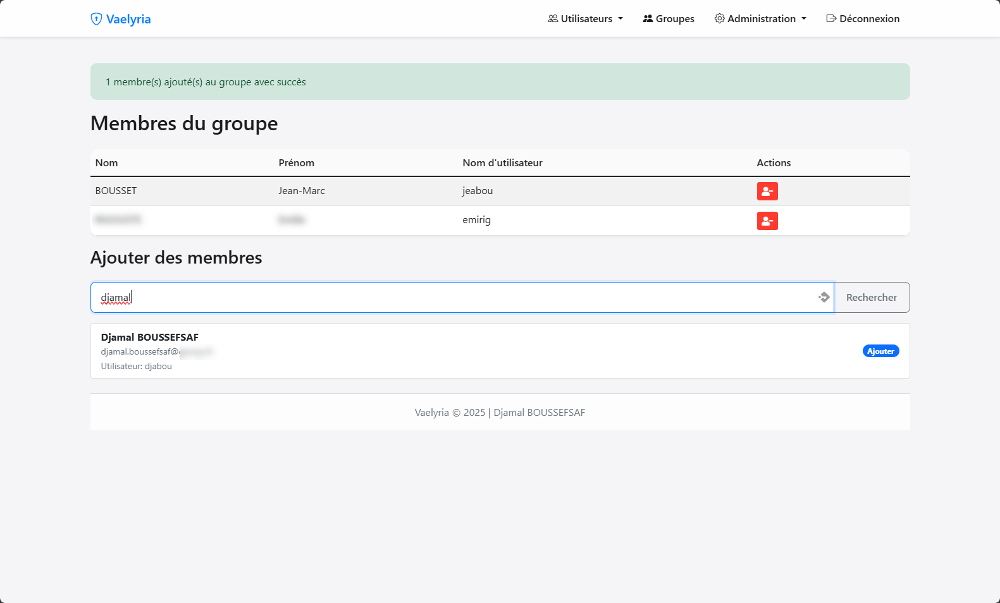

- Gestion complète des membres :
  - Ajout/suppression de membres
  - Recherche dynamique d'utilisateurs
  - Ajouts multiples en une seule opération
- Export des membres avec choix des attributs
- Suppression ou déplacement de groupe
- Interface de déplacement avec sélection d'OU

### Gestion des profils

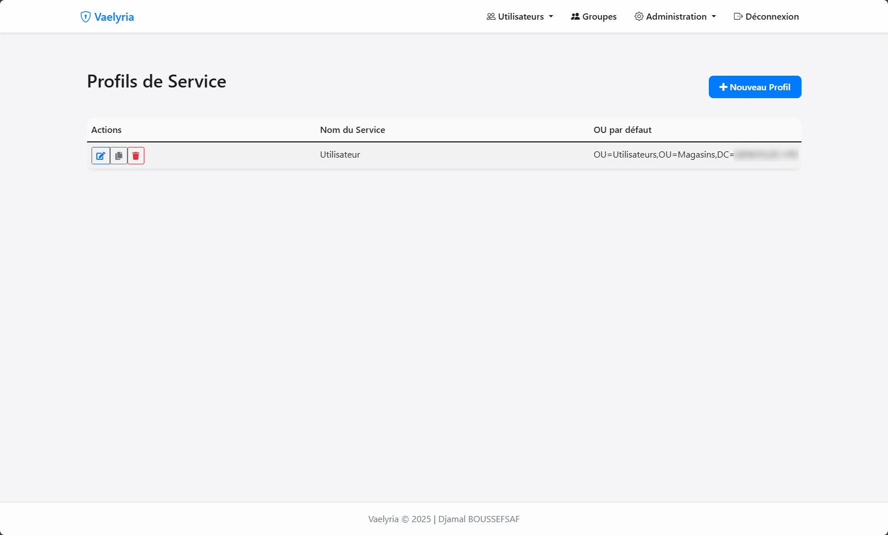

- Gestion des modèles de profils de service
- Liste des profils avec actions rapides
- Duplication de profils existants
- Interface de création et d'édition intuitive

#### Création de profil

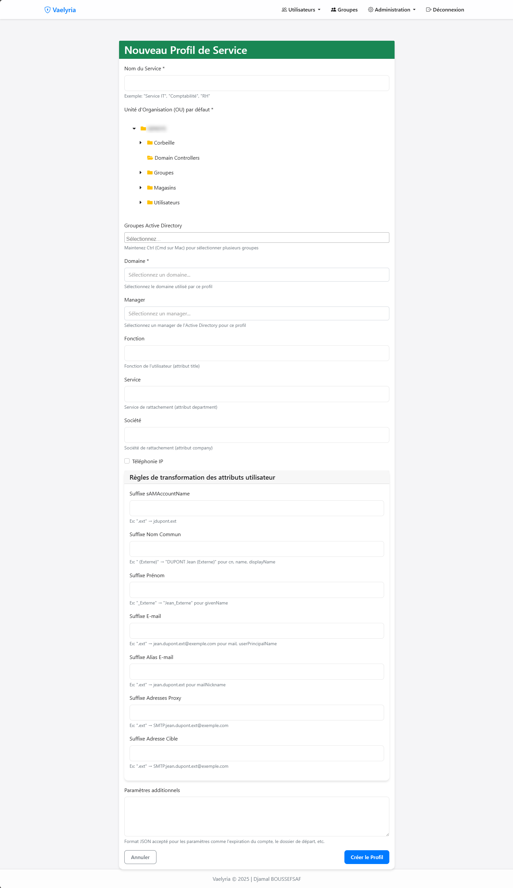

- Configuration complète des attributs utilisateur :
  - OU par défaut
  - Groupes AD
  - Domaine
  - Manager
  - Fonction et service
- Règles de transformation des attributs :
  - Suffixes pour sAMAccountName
  - Formats pour noms communs
  - Configuration des emails
- Support de paramètres additionnels en JSON

#### Édition de profil

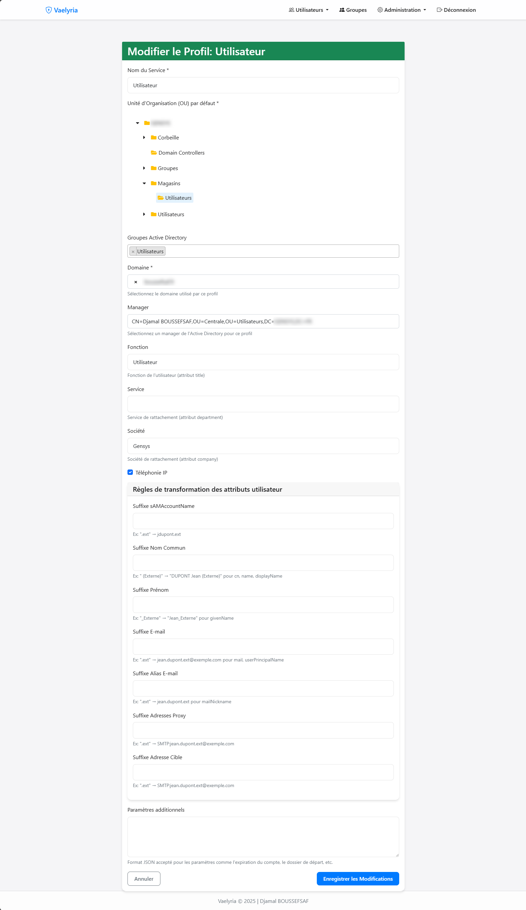

- Modification de tous les paramètres du profil
- Interface identique à la création
- Prévisualisation des transformations
- Validation des paramètres JSON

### Configuration LDAP

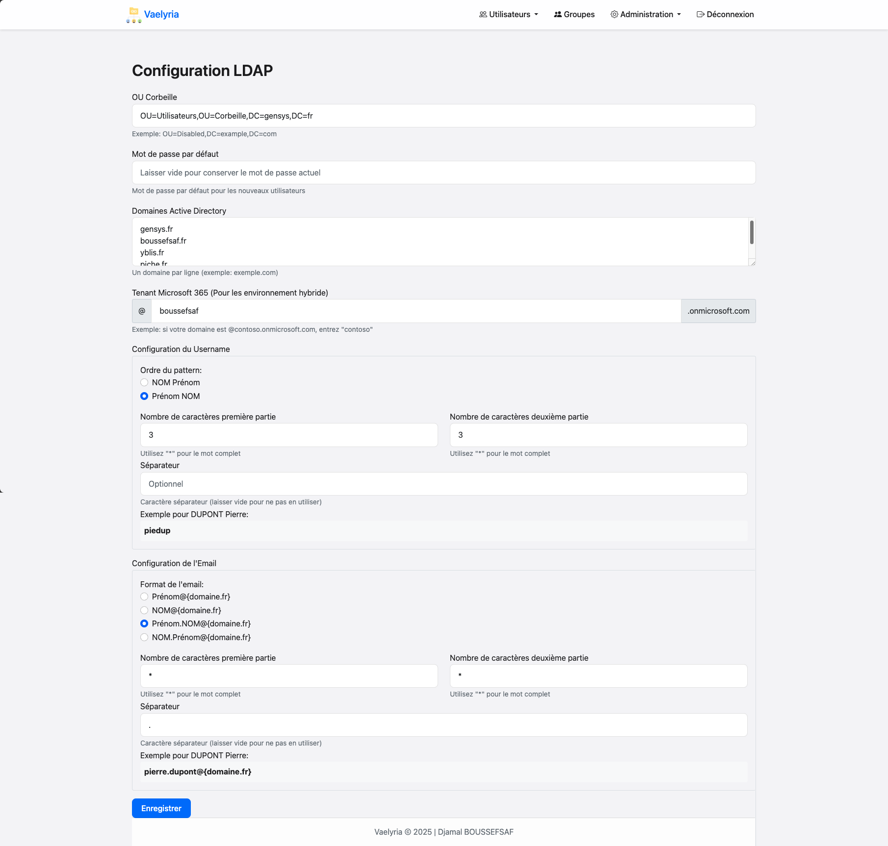

- Configuration de l'OU Corbeille
- Gestion du mot de passe par défaut avec chiffrement
- Configuration des domaines AD
- Paramétrage du tenant Microsoft 365
- Configuration du format de username :
  - Ordre (NOM_PRENOM ou PRENOM_NOM)
  - Nombre de caractères
  - Séparateur personnalisé
- Configuration du format d'email :
  - Ordre (NOM_PRENOM ou PRENOM_NOM)
  - Nombre de caractères
  - Séparateur personnalisé
- Prévisualisation en temps réel des formats

### Journalisation des activités

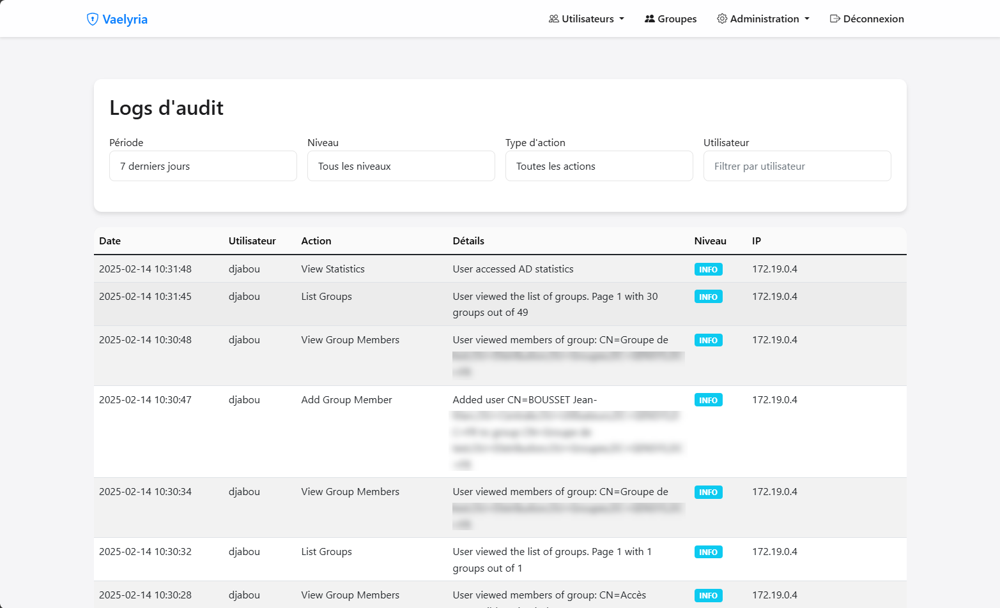

- Journalisation complète des actions
- Filtres multiples :
  - Période (24h, 7j, 30j, tout)
  - Niveau (info, warning, error, critical)
  - Type d'action
  - Utilisateur
- Pagination des résultats
- Affichage détaillé :
  - Horodatage
  - Utilisateur
  - Action
  - Détails
  - Niveau
  - Adresse IP

## Variables d'environnement

L'application utilise les variables d'environnement suivantes, définies dans le fichier `.env` :

*   `FLASK_SECRET_KEY`: La clé secrète pour la signature des cookies de session.
*   `LDAP_SERVER`: L'adresse IP ou le nom d'hôte du serveur LDAP.
*   `BASE_DN`: Le Distinguished Name (DN) de base pour le répertoire LDAP.
*   `LDAP_PORT`: Le port du serveur LDAP (défaut: 636 pour LDAPS, 389 pour LDAP).
*   `LDAP_USE_SSL`: Active/désactive l'utilisation de SSL/TLS pour la connexion LDAP (true/false).
*   `AUTHORIZED_AD_GROUP`: Le DN du groupe Active Directory autorisé à accéder à l'application.
*   `LOG_RETENTION_MONTH`: Le nombre de mois de conservation des logs (minimum: 1).

## Installation

1. Cloner le dépôt

   ```bash
   git clone [url-du-depot]
   ```
2. Installer les dépendances

   ```bash
   pip install -r requirements.txt
   ```
3. Configurer les variables d'environnement

   - Copier `.env.exemple` vers `.env`
   - Mettre à jour les variables selon votre environnement
4. Lancer l'application

   ```bash
   python app.py
   ```

## Docker

L'application peut être exécutée dans un conteneur Docker en utilisant les fichiers `Dockerfile` et `docker-compose.yml` fournis.

Pour construire l'image Docker :

```bash
docker build -t vaelyria .
```

Pour exécuter l'application avec Docker Compose :

```bash
docker-compose up -d
```

Le fichier `docker-compose.yml` inclut également une configuration pour Traefik, un reverse proxy HTTP moderne avec gestion automatique des certificats HTTPS.

## Prérequis système

- Python 3.8+
- Serveur Active Directory/LDAP
- Navigateur web moderne avec JavaScript activé
- Connectivité réseau vers le serveur AD

## Dépendances principales

L'application utilise les dépendances suivantes :

*   `Flask`: Framework web Python.
*   `flask-sqlalchemy`: Extension Flask pour SQLAlchemy.
*   `ldap3`: Client LDAP Python.
*   `openpyxl`: Bibliothèque pour les fichiers Excel.
*   `pandas`: Bibliothèque d'analyse de données.
*   `Werkzeug`: Bibliothèque web WSGI.
*   `flask-login`: Gestion des sessions utilisateur.
*   `python-dotenv`: Lecture des variables d'environnement.
*   `cryptography`: Bibliothèque de cryptographie.
*   `Flask-APScheduler`: Planification des tâches.

## Fonctionnalités de sécurité

- Communication LDAP sécurisée via SSL/TLS (LDAPS)
- Contrôle d'accès basé sur les rôles
- Journalisation et audit complets des actions
- Gestion sécurisée des sessions
- Chiffrement des mots de passe avec Fernet
- Validation des entrées utilisateur
- Protection contre les attaques CSRF
- Gestion sécurisée des mots de passe temporaires

## Contribution

Les contributions sont les bienvenues !

## 🛠️ Licence

Ce projet est sous licence **AGPLv3**.  
Vous êtes autorisé à l'utiliser, le modifier et le distribuer, à condition de respecter les termes de la licence, notamment l'obligation de mentionner l'auteur d'origine.

**Vaelyria** - Active Directory Management Application est développé par **Djamal Boussefsaf**.  
[🔗 Consultez la licence complète ici](LICENSE).

## Support

Pour le support et les demandes de fonctionnalités, veuillez ouvrir une issue dans le dépôt du projet.
