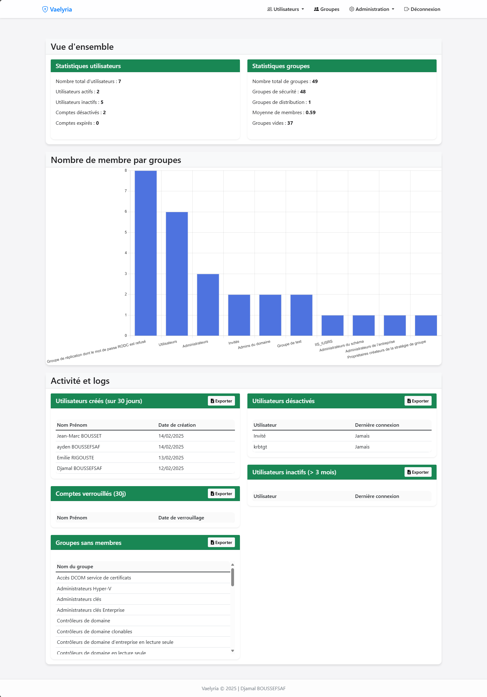

# Project Structure Explained

## Core Components

1. **Backend (Python/Flask)**
   - `app.py`: Main application entry point
   - `models.py`: Database models
   - `ldap_utils.py`: LDAP integration utilities
   - `audit_log.py`: Logging functionality

2. **Routes**
   - User management (`routes/users.py`)
   - Group management (`routes/groups.py`)
   - Authentication (`routes/auth.py`) 
   - Service profiles (`routes/service_profiles.py`)
   - Settings (`routes/settings.py`)
   - Logs (`routes/logs.py`)

3. **Frontend**
   - HTML templates in `templates/`
   - Static assets in `static/`
     - CSS styles
     - JavaScript modules
     - Icons for PWA
   - Progressive Web App support (`sw.js`, `manifest.json`)

4. **Internationalization**
   - Support for English and French
   - Translation files in `translations/`

## Key Features

1. **User Management**
   
   - Create, edit, and search users
   - Manage user attributes and permissions

2. **Group Management** 
   
   - Create and manage groups
   - Assign members to groups

3. **Service Profiles**
   - Template-based profile management
   - Profile creation and editing

4. **LDAP Settings**
   
   - Configure LDAP connection
   - Manage LDAP structure

5. **Monitoring**
   - Audit logging
   - Statistics dashboard
   
